## Hello/ Hola!/ Ciao! {.smaller}

::::: columns
::: column
{width="250"}

**Betsy Cohen**

:::

::: column
{width="250"}

**Jesica Formoso**

:::
:::::

::: notes
Presentación de Jes\
I'm Jesica, a cognitive psychologist with a PhD in Ethical, Humanistic, and Social Medical Sciences from the University of Buenos Aires (UBA), and a tenured Research Associate at the National Scientific and Technical Research Council ([CONICET](https://www.conicet.gov.ar/new_scp/detalle.php?id=52112&datos_academicos=yes)).

Presentación de Betsy

I'm Betsy Cohen I'm currently organizer at: **RLadies Buenos Aires**: A global organisation that promotes gender diversity in the R community and at **Núcleo de Innovación Social**: An inter-disciplinary research and development team in social sciences and technology.
:::

## Agenda

-   Why Reproducibility?

-   What is Quarto?

-   Core Use Cases: a short walk around

-   Academic Production with Quarto Journal and Manuscripts

    -   Journal Templates

    -   Quarto Manuscript Projects

    -   Citations, Cross references, and authoring

-   Learning More

## On the shoulders of giants

This presentation is based on:

-   [Quarto Manuscripts official documentation](https://quarto.org/docs/manuscripts/)

-   Slides and materials for the"Reproducible Manuscripts with Quarto" talk at posit::conf(2023). by [Mine Çetinkaya-Rundel](https://mine.quarto.pub/manuscripts-conf23/#/title-slide)

-   Quarto for Academics [video](https://www.youtube.com/watch?v=EbAAmrB0luA&list=PL8se4oifL2ThKAU95XXjThAcuCqJr--8I&index=10) on YouTube by Mine Çetinkaya-Rundel and Posit

-   R/Medicine: Quarto for Reproducible Medical Manuscripts by Mine Cetinkaya-Rundel webinar in youtube [video](https://www.youtube.com/watch?v=NK1onTLcgY4&t=1228s)

-   The Turing Way Community, & Scriberia.(2024) on https://book.the-turing-way.org/

# Why Reproducibility?

## What do we mean by reproducibility

[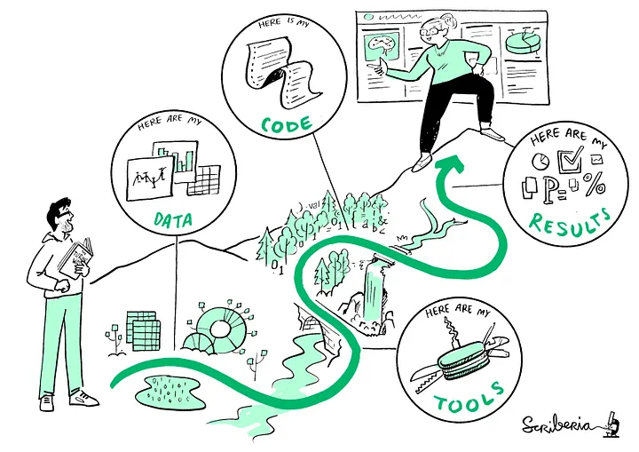{fig-alt="The Turing Way project illustration by Scriberia. Used under a CC-BY 4.0 licence. DOI: The Turing Way Community & Scriberia (2024)."}](https://zenodo.org/records/13882307)

::: notes
There are several definitions of reproducibility in use but in the context of this meeting we will refer to reproducibilty in as *Computational reproducibility: When detailed information is provided about code, software, hardware and implementation details.* In other words Reproducibility means that someone else ---or even you in six months--- can take your data and your code, run it again, and get the same results.
In research, this ensures transparency, trust, and the ability to build upon previous work.
It's like leaving breadcrumbs through the forest of your analysis so no one gets lost.
:::

# What is Quarto?

## Quarto General Workflow

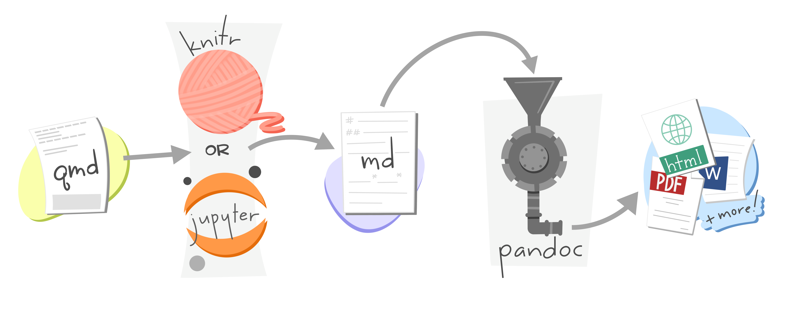

::: notes
If you have worked with RMarkdown before you can think of Quarto as the new and emproved generation of it.
:::

## Quarto for R and other languages

:::: columns
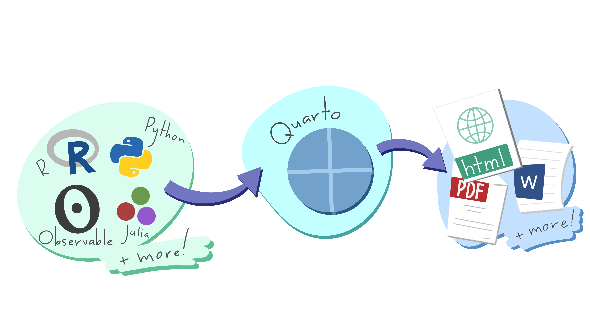

::: notes
A multi-language, next generation version of R Markdown from Posit, with many new features and capabilities.

Like R Markdown, Quarto uses knitr to execute R code, and is therefore able to render most existing Rmd files without modification.
:::
::::

## Use Cases

-   🗃️**Dynamic Documents**

-   🌄**Beautiful Publications**

-   🧪**Scientific Markdown**

-   🕸️**Websites and Books**

-   📽️**Interactivity**

. . .

Take a visit to Quarto Gallery [here](https://quarto.org/docs/gallery/)

::: notes
-   🗃️**Dynamic Documents**: Generate dynamic output using Python, R, Julia, and Observable.
    Create reproducible documents that can be regenerated when underlying assumptions or data change.

-   🌄**Beautiful Publications**: Publish high-quality articles, reports, presentations, websites, and books in HTML, PDF, MS Word, ePub, and more.
    Use a single source document to target multiple formats.

-   🧪**Scientific Markdown:** Pandoc markdown has excellent support for LaTeX equations and citations.
    Quarto adds extensions for cross-references, figure panels, callouts, advanced page layout, and more.

-   🕸️**Websites and Books:** Publish collections of documents as a blog or full website.
    Create books and manuscripts in both print formats (PDF and MS Word) and online formats (HTML and ePub).

-   📽️**Interactivity:** Engage readers by adding interactive data exploration to your documents using Jupyter Widgets, htmlwidgets for R, Observable JS, and Shiny.
:::

# A short walk around

## Install Quarto

{fig-align="center"}

## Create a Quarto File in a project we already have in our computer

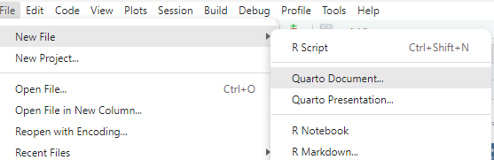{fig-align="center"}

## Create a New Quarto Project

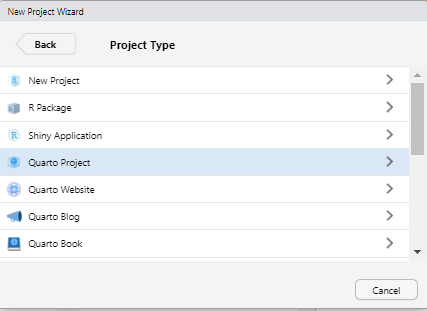{fig-align="left"}

## General folder structure in a Quarto Project

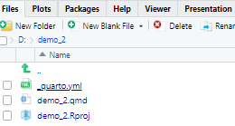

::: notes
When we create a Quarto project we'll automatically create RPorj file (as in any other Quarto project) and a .yml file (for the entire project), my Quarto document (the one that has the .qmd extension.
:::

## Quarto file general structure

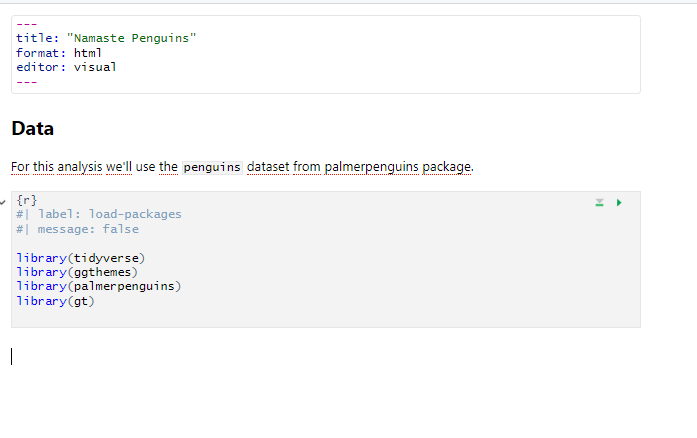

::: notes
For those of you have worked with RMarkdown before this should be familiar, at the top we have a YAML with some metadata about our file, like the title, format (we'll start by an html)
:::

## Visual mode vs Source mode

{fig-align="center"}

::: notes
The Quarto visual editor is currently available as a feature of the [RStudio IDE](https://posit.co/download/rstudio-desktop/). The visual editor will eventually also be made available in standalone form.
You can switch over the source editor, and things should look pretty familiar to you.

The visual editor where you get a documeny that feels similar to a Google Doc in an app-like notion wehere yjos are a liitle bit more you see-what-you-get.

For example I hace some infromation about the data set and I may want to bold the name if the package.

I can add a link to a website.
:::

## Visual mode shortcuts

::: columns
::: {.column width="50%"}

:::

::: {.column width="50%"}

:::
:::

## Insert Code Chunks

::: notes
In the same way that we did in RMarkdown we can add chunk codes
:::


## Code chunk options

::: notes
As is RMarkdown Quarto allows us to control different aspects of how chunks behave
:::

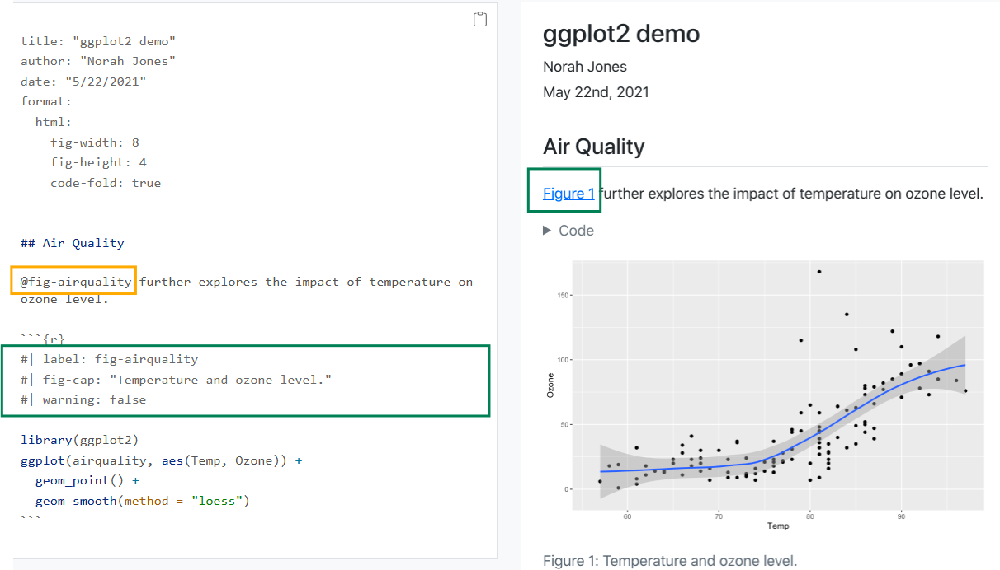

## Code Chunk Options {.smaller}

You can add Quarto options to code cells by adding a #\| comment to the top, followed by the option in YAML syntax.
For example, adding the echo option with the value true would look like this:

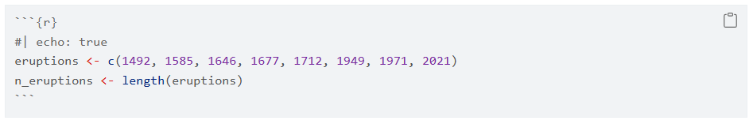{width="848"}

The `echo` option describes whether the code is included in the rendered article.
If you make this change and save index.qmd, you'll see this code now appears in the article.

::: callout-tip
### Code chunk options guide

You can find a list of all the code cell options available on the Knitr Code Cell reference page at <https://quarto.org/docs/reference/cells/cells-knitr.html>
:::

## Code chunk options from YAML

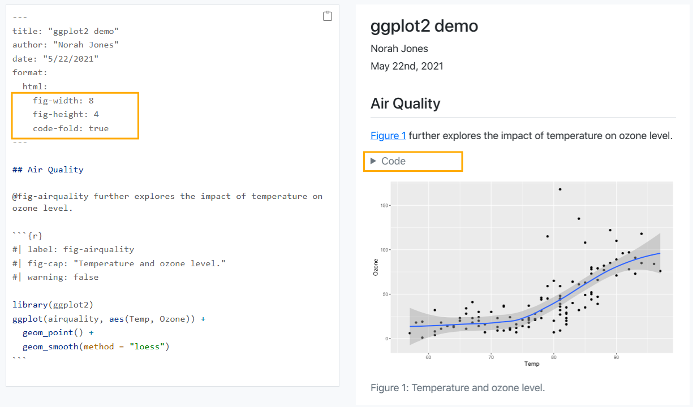


# Quarto for manuscripts and journal articles

## Quarto can ... {.smaller}

-   be **authored** in your favorite **code editor**

-   apply **journal styles** to your outputs with Quarto extensions

-   orchestrate **multiple inputs and outputs** with embedded computing using a new `Quarto project type: manuscript`

-   produce manuscripts in **multiple formats** (including LaTeX or MS Word formats required by journals), and give readers easy access to all of the formats through a website

-   publish **computations from one or more notebooks** alongside the manuscript, allowing readers to dive into your code and view it or interact with it in a virtual environment

-   publish to **GitHub** Pages, **Netlify**, and more

## Journals vs Manuscripts

In Quarto, a **journal** refers to a **single document**, potentially with embedded computations and visualizations, designed for publication in a journal format.

<br>

A **manuscript**, on the other hand, represents **a collection of Quarto documents**, potentially including multiple chapters, that are intended to be assembled into a book-like structure.

## Journals

::: notes
If you just want to create one Quarto document for your journal you can find some templates in the GitHub repo at https://github.com/quarto-journals
:::

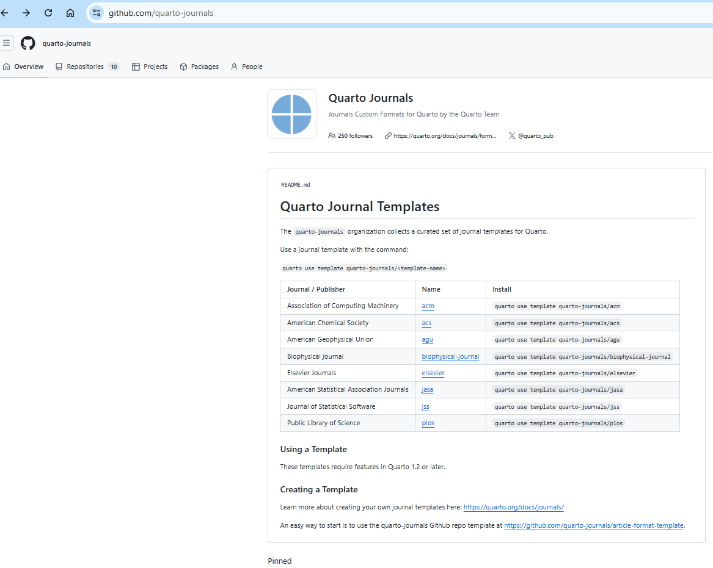

## Installing the templates from your terminal


## How does the journal template file looks like

::: notes
Once we have copy the template the file folder will look something like this. 
:::

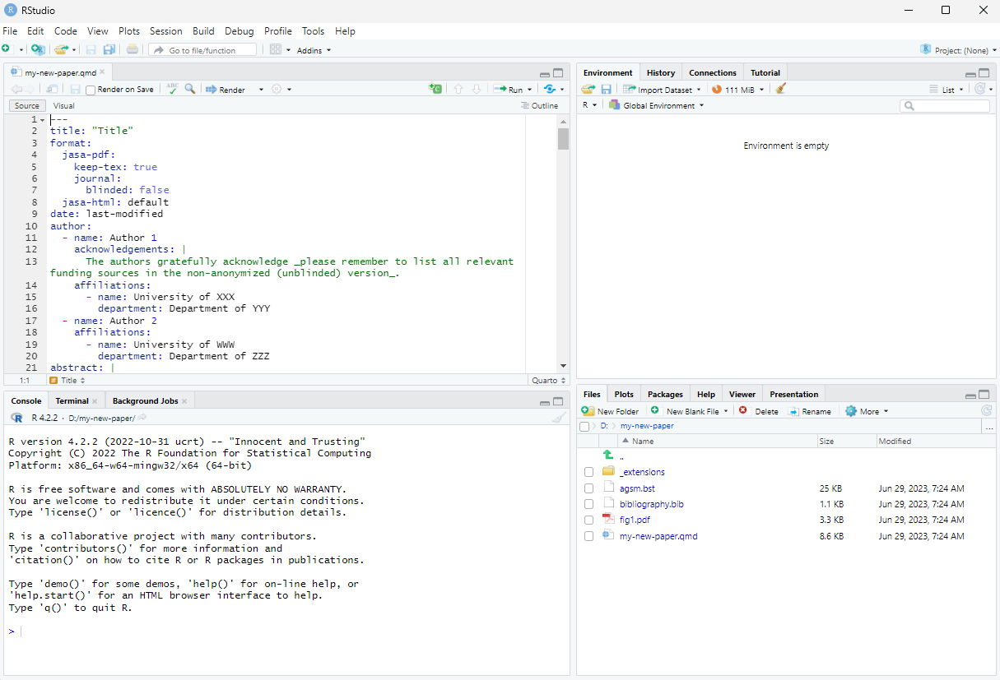

## Rendering a Journal paper


## Getting started with a manuscript: create a manuscript project

::: notes
All the things that we are going to see can also apply to Journal paper the only difference remain on the complexity and structrure of the folders.
:::

-   **Start from scratch**

    -   in your terminal write `quarto create project manuscript <name>`
    -   then start adding manuscipt content or...

-   **Start with a sample from <https://quarto.org/docs/manuscripts>**

<br>

. . .

::: callout-tip
Learn how to Track your project with Git and host on GitHub for happy publishing.
:::


## Your Turn! Option 1

::: notes
As I asume that maybe not all of you have experience working with git hub we're gone practice a semi reproductrivble version of how tob worlk with repoductible manuscripts.
If you are familiarizedf eith github you'll finde the cmplete worknlow in the Quarto documentation iun the Manusucript section.
Go to your RStudio Terminal and create a new project from scratch by tiping the following text.
:::

If you already have a peper of your own (with differnt r files with code) go to your RStudio Terminal and create a new project from scratch

``` {.bash filename="Terminal"}
quarto create project manuscript indo-rct

Creating project at /Users/mine/indo-rct:
  - Created _quarto.yml
  - Created index.qmd
  - Created references.bib
 ? Open With
   vscode
 ❯ rstudio
   (don't open)
```

## Your Turn! Option 2 {.smaller}

If you wanna follow along the same structure we are going to you can copy the repo from github repo

https://github.com/quarto-ext/manuscript-template-rstudio/tree/main

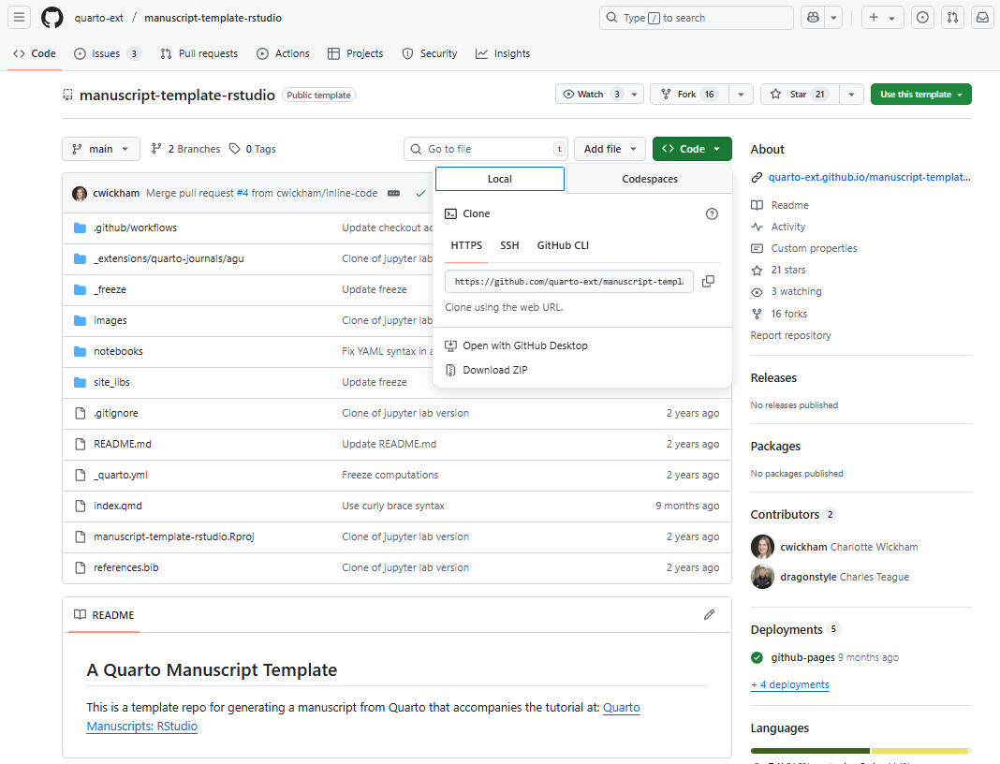{fig-align = "center"}

## Your turn!: Ready, steady, go!

👍 Please sign me with when you are ready.


## Quarto manuscript: minimal folder structure

::: notes
When we create a project from scratch Wuarto creates a minimal project structure, that includes a \_quarto.yml the index.qmd notebook (where we'll write the manuscript) and a reference.bib for the citiations and reference we'll use along our paper.
:::

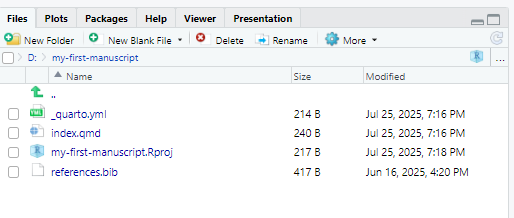{fig-align="center" width="640"}

## Quarto manuscript: minimal manuscript \_quarto.yml

``` {.yaml filename="_quarto.yml"}
project:
  type: manuscript

manuscript:
  article: index.qmd

format:
  html:
    comments:
      hypothesis: true
  docx: default
  jats: default

  # (other formats)
  # pdf: default
execute:
  freeze: true
```

::: notes
If we take a look at \_YAML file we hace project type and an article is the index.qmd

we can also see that we have a format part with bunch of formats: an html , a docx and a jats tof all of your documents that some of the uh journals um accept grabbing this archive um that goes along uh with the with your uh manuscript to sort of have a full um Archive of all of the work that has gone into that project.
and we can do other formats as PDF.
:::

## Basic workflow

The basic workflow for writing a manuscript in Quarto is to make changes to your article content (the index.qmd if you are following the example), preview the changes with Quarto, and repeat.


## How does it look like once render?

```{=html}
<iframe src="https://dragonstyle.github.io/submission-quarto-lite-r/" title="La Palma Earthquakes" width="1100px" height="600px"></iframe>
```

::: notes
so this is how the final product will look like so we have a bunch of **matadata** regarding autihring, title, pushinjg date, the orher formas, some links that will leadme to the **github repositorory** as a **Binder** link, a **TOC** that I get by default, and embeded notebook that.
Also we can see some **Quarto fetaures** like **Figures refrences**, equiations.

Another cool feature is the hypotesis option thatyou can asee as we higlight some text and Quarto will let you higlight some text and add some annotations,
:::

## You can follow along in your first manuscript quarto qmd render

-   Open index.qmd.
-   Render and preview the manuscript by hitting the Render button located in the menu bar of the editor
-   You'll see some output from Quarto in the Background Jobs pane and then a live preview will appear in the Viewer pane.
-   Change the title of your index.qmd
-   Save the file, re-render, and you'll see the preview update.


## One qmd to rule all formats

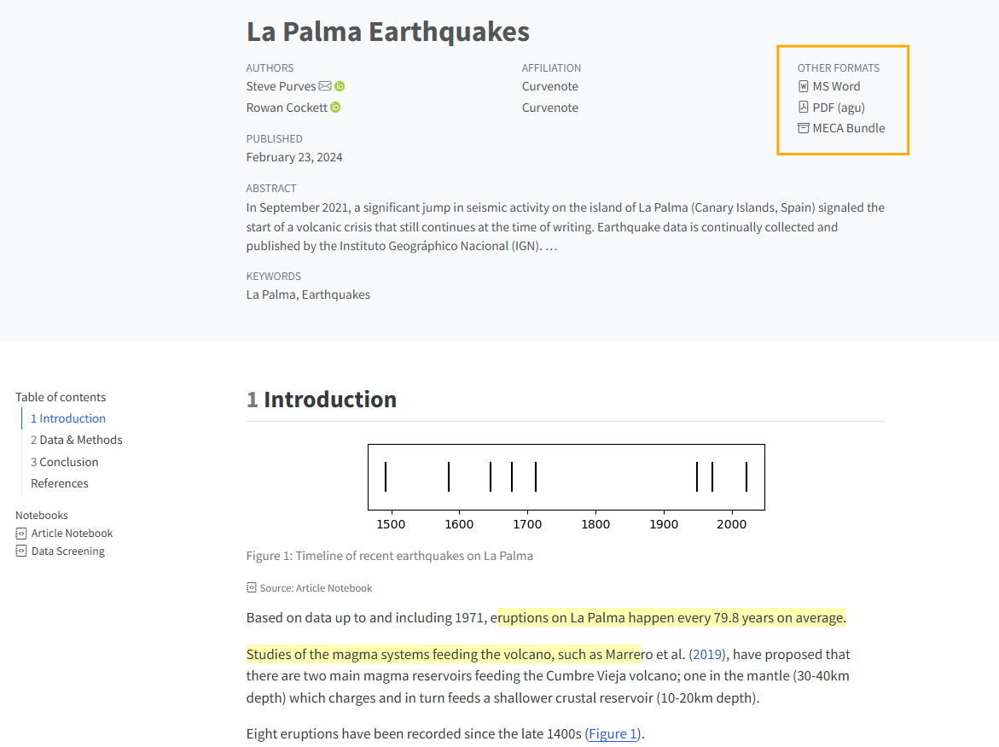{fig-align = "center"}

::: notes
As we says before we can get multiple formats fropm one qmd file.
In order to get this we are get this we just have to add some .lines un our \_quarto.yml file
:::

## One qmd to rule all formats

``` {.yaml filename="_quarto.yml"}
format:
  html:
    comments:
      hypothesis: true
  docx: default
  jats: default
  plos-pdf:
    keep-tex: true
```

::: notes
I Have 4 outputs that are listed the html that is the one that we are looking but qwe also have de docx, the jats and the pdf.
The comments hypotesis true alllows to activate for my html file, so it allows to add the comments as we have seen before and for the pdf we also have differnt options in order to kepp the reprodutibility: we can keep the the markdown files genreates (keep-md), the notbook files genreated (keep-ipynd), or as I'm choosimg here the intermediate text files that are genrested.
Which I find especially helpful as I work on a manuscript every once in a while there are some tech error that I'm only able to resolve by simply opening the tech document itself and rendering that and trying to look at the log of it so it's helpful to have that intermediary file available it also is one other way you can share with your collaborators again who may not be the people writing code but who might be familiar with latch additionally in the index.
qmd file
:::

## Setting the **Front matter** of your index.qmd

``` {.yaml filename="_index.qmd"}

title: La Palma Earthquakes
author:
  - name: Steve Purves
    orcid: 0000-0002-0760-5497
    corresponding: true
    email: steve@curvenote.com
    roles:
      - Investigation
      - Project administration
      - Software
      - Visualization
    affiliations:
      - Curvenote
  - name: Rowan Cockett
    orcid: 0000-0002-7859-8394
    corresponding: false
    roles: []
    affiliations:
      - Curvenote
keywords:
  - La Palma
  - Earthquakes
abstract: |
  In September 2021, a significant jump in seismic activity on the island of La Palma (Canary Islands, Spain) signaled the start of a volcanic crisis that still continues at the time of writing. Earthquake data is continually collected and published by the Instituto Geográphico Nacional (IGN). ...
plain-language-summary: |
  Earthquake data for the island of La Palma from the September 2021 eruption is found ...
key-points:
  - A web scraping script was developed to pull data from the Instituto Geogràphico Nacional into a machine-readable form for analysis
  - Earthquake events on La Palma are consistent with the presence of both mantle and crustal reservoirs.
date: last-modified
bibliography: references.bib
citation:
  container-title: Earth and Space Science
number-sections: true
---
```

::: notes
So apart from the obvous as the title we can set here the outaurs with all tge information about them as the affiliation their orcid email, the roles they have in the project, thir email, also we can add the keyword for our paper, as well as the abstract, date, as well as the refereces document for bibliography and, and citations.
:::

## Using computations in the body of youtr text

You can use computed values directly in your article text using the syntax `` `{{r}} expr` ``.
For example, consider this line in `index.qmd`:

``` markdown
Based on data up to and including 1971, eruptions on La Palma happen every `{{r}} round(avg_years_between_eruptions, 1)` years on average.
```

When rendered, it displays as:

. . .

> Based on data up to and including 1971, eruptions on La Palma happen every 79.8 years on average.

## Code chunks for computations using the `lable` and `fig-` options

::: notes
So we have already seen the echo option and that we can embeded calculations and references.
In this chunck the label option is used to add an identifier to code cell and its output, for example to allow cross referencing.
The prefix fig- is required for figure cross references, but the suffix, in this case timeline, is up to you.
We'll get back to Cross References in a moment, but for now the import thing is to understand that the option fig-cap provides the caption text displayed below the figure in the manuscript, and fig-alt provides alt text for the figure, helping your manuscript webpage to meet accessibility guidelines.

Computations are also a good way to include tables based on data.
You can read more about doing this in the Quarto documentation on Tables from Computations.
:::

```{{r}}
#| label: fig-timeline
#| fig-cap: Timeline of recent earthquakes on La Palma
#| fig-alt: An event plot of the years of the last 8 eruptions on La Palma.
#| fig-height: 1.5
#| fig-width: 6
par(mar = c(3, 1, 1, 1) + 0.1)
plot(
  eruptions, rep(0, n_eruptions), 
  pch = "|", axes = FALSE
)
axis(1)
box()
```

## Citations

::: notes
To add citations you need a bibliography file, .bib, containing the citation data.
You can specify this file in the document YAML with the bibliography option.
For example, the citation data for index.qmd is stored in references.bib

The file references.bib contains only one citation and it looks something like this

To cite an article from the bibliography in your text, you use \@ followed by the citation identifier, e.g. marrero2019.
For example, the article includes this line citing this reference will read something like
:::

``` {.yaml filename="references.bib"}
@article{marrero2019,
  author = {Marrero, Jos{\' e} and Garc{\' i}a, Alicia and Berrocoso, Manuel and Llinares, {\' A}ngeles and Rodr{\' i}guez-Losada, Antonio and Ortiz, R.},
  journal = {Journal of Applied Volcanology},
  year = {2019},
  month = {7},
  pages = {},
  title = {Strategies for the development of volcanic hazard maps in monogenetic volcanic fields: the example of {La} {Palma} ({Canary} {Islands})},
  volume = {8},
  doi = {10.1186/s13617-019-0085-5},
}
```

## Citations {.smaller}

<br>

``` markdown
Studies of the magma systems feeding the volcano, such as @marrero2019, have proposed ...
```

<br>

When rendered, it displays as:

. . .

> Studies of the magma systems feeding the volcano, such as Marrero et al. (2019), have proposed

## Citations {.smaller}

...
and when hovering over the citation text it reveals the full reference details allowing reader to click on the citation and take it to the reference in the References section at the end of the article:

. . .


## Citations

Another common style is to place the citation within parentheses at the end of a sentence.
You can achieve this by enclosing the citation syntax in square brackets \[.
For example,

``` markdown
A prior study of the magma systems feeding the volcano proposed that there are two main magma reservoirs feeding the Cumbre Vieja volcano [@marrero2019].
```

<br>

When rendered, it displays as:

. . .

> A prior study of the magma systems feeding the volcano proposed that there are two main magma reservoirs feeding the Cumbre Vieja volcano (Marrero et al. 2019).


## Citations

::: callout-tip
Quarto support differnt syntax variotions to include page numbers, chapters, exclude author names and other cool posibilities. You can learn more about it the Citation documentation at https://quarto.org/docs/authoring/citations.html 
:::


## Your Turn! Add a citation to your bib file and use it

-   Go to your bib file and add a citation
-   Go back to your index.qmd file and use the citation
-   Render your file and chevck the changes

## Your turn!: Ready, steady, go!

👍 Please sign me with when you are ready.


## Cross References 

:::notes
Quarto can generate cross references that keep track of numbering and linking for you. The general syntax for a cross reference is an `@` followed by a `label`. For example, to reference the timeline figure, you could write:
To render the cross references you have to include a word to indicate the type of object being referenced, like “Figure” or “Table”, so this:
:::

Labeled as...

``` markdown
@fig-timeline
```
Should be use used as

.   .   .

``` markdown
Eight eruptions have been recorded since the late 1400s (@fig-timeline).
```
And will look something like

.   .   .

> Eight eruptions have been recorded since the late 1400s (Figure 1).


## Cross References element and prefix

-   Figure `fig-` and will render as **Figure 1**

-   Table `tbl-` and will render as **Table 1**

-   Equation `eq-` and will render as **Equation 1**

-   Section `sec-` and will render as **Section 1**

. . .

::: callout-warning
To cross reference sections your document YAML header must also include `number-sections: true` You can add a label to a section heading in curly braces after the heading, e.g `## Data & Methods {#sec-data-methods}` and the you can then reference this section in the text by adding the text and the \@ reference like `Data and methods are discussed in @sec-data-methods.` <br>
:::

## Cross Reference in visual mode {.smaller}


## Static Figures, and Images

To include a figure from a file, the markdown syntax looks like:

``` markdown

```

By using #fig-name-of-image inside curly braces following the image path you can provide the reader a label for cross references.
For eg.

``` markdown
{#fig-map fig-alt="A map of the Canary Islands. The second most west island, La Palma, is highlighted."}
```

::: callout-tip
It is recomended to store your in an folder named images/.
Your images can be anywhere inside your manuscript project directory, just make sure you include the full path to the image, relative to the location of `index.qmd.`
:::


## Publishing

To publish your site on GitHub Pages simply tipe

``` {.bash filename="Terminal"}
quarto publish
```

Choose GitHub Pages or the platform you prefer.

You can learn more about publishing at https://quarto.org/docs/publishing/

## What else can I do with Quarto? Presentations 📺

```{=html}
<iframe src="https://apreshill.github.io/palmerpenguins-useR-2022/#/title-slide" title="Presentations like The untold story of palmerpenguins" width="1100px" height="600px"></iframe>
```

## What else can I do with Quarto? Dasboards! 📈

```{=html}
<iframe src="https://mine-cetinkaya-rundel.github.io/ld-dashboard/" title="Dashboards like this one by Mine Cetinkaya" width="1100px" height="600px"></iframe>
```

## What else can I do with Quarto? Your Personal website 🌐

```{=html}
<iframe src="https://www.mm218.dev/" title="Your Personal Website like Mike Mahoney" width="1100px" height="600px"></iframe>
```

## What else can I do with Quarto? Your First Book 📖

```{=html}
<iframe src="https://r4pde.netlify.app/" title="Your Book like R for Plant Disease Epidemiology by Emerson M. Del Ponte" width="1100px" height="600px"></iframe>
```

## Thank you! {.bigtext}

<br>

 [https://www.linkedin.com/company/rladies-ba/](https://www.linkedin.com/company/rladies-ba/)

 [https://rladiesba.netlify.app/](https://rladiesba.netlify.app/)


